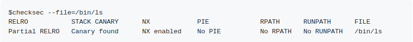

# Examining Binaries

#### Checksec

Check the properties of a binary with [Checksec](https://github.com/slimm609/checksec.sh).

Output example from their repo:

#### Hardening Check

Check binaries for security hardening features. I find it less reliable when it comes to RELRO.

Included in the **devscripts** package on debian-based distros.

